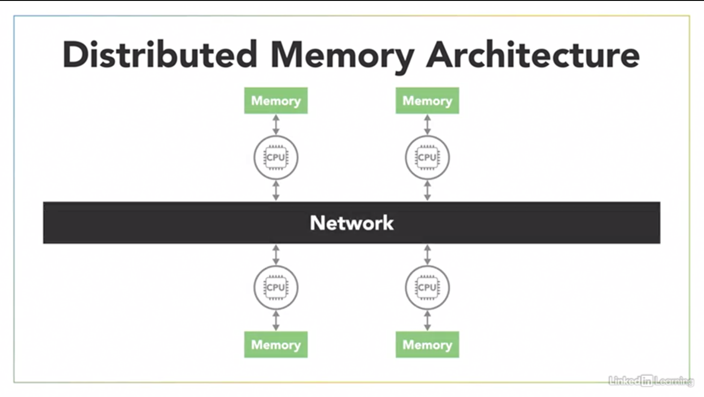
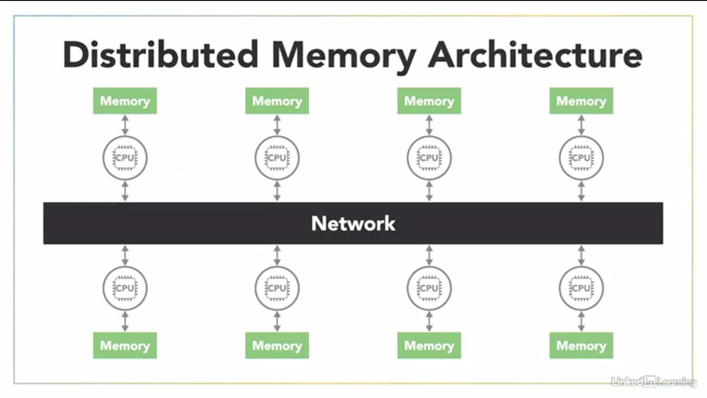

- [Parallel Computing Hardware](#parallel-computing-hardware)
  - [Sequential versus Parallel Computing](#sequential-versus-parallel-computing)
  - [Parallel Computing Architecture](#parallel-computing-architecture)
    - [Single Instruction Single Data (SISD)](#single-instruction-single-data-sisd)
    - [Single Instruction Multple Data (SIMD)](#single-instruction-multple-data-simd)
    - [Multiple Instruction Single Data (MISD)](#multiple-instruction-single-data-misd)
    - [Multiple Instruction Multiple Data MIMD](#multiple-instruction-multiple-data-mimd)
      - [Single Program Multiple Data (SPMD)](#single-program-multiple-data-spmd)
      - [Multiple Program Multiple Data (MPMD)](#multiple-program-multiple-data-mpmd)
  - [Shared versus Distributed Memory](#shared-versus-distributed-memory)
    - [shared memory](#shared-memory)
      - [uniform memory access (UMA)](#uniform-memory-access-uma)
        - [symmetric multi-processing (SMP)](#symmetric-multi-processing-smp)
      - [non-uniform memory access (NUMA)](#non-uniform-memory-access-numa)
    - [Distributed memory system](#distributed-memory-system)

# Parallel Computing Hardware

## Sequential versus Parallel Computing

A computer program is just a list of instructions that tells a computer what to do like the steps in a recipe that tell me what to do when I'm cooking. Like a computer, I simply follow those instructions to execute the program.

As a single cook working alone in the kitchen, I'm a single processor executing this program in a sequential manner. The program is broken down into a sequence of discreet instructions that I execute one after another. And I can only execute one instruction at any given moment. There's no overlap between them. The time it takes for a sequential program to run is limited by the speed of the processor and how fast it can execute that series of instructions. I'll slice, and chop ingredients as fast as I can, but there's a limit to how quickly I can complete all of those tasks by myself.

Two cooks in the kitchen represent a system with multiple processors. Now that we can break down the salad recipe and execute some of those steps in parallel

Working together, we broke the recipe into ***independent parts that can be executed simultaneously by different processors***. While I was slicing cucumbers and onions, Barron was chopping lettuce and tomatoes. That final step of adding dressing was dependent on all of the previous steps being done. So we had to coordinate with each other for that step

Adding a second cook in the kitchen doesn't necessarily mean we'll make the salad twice as fast, because having extra cooks in the kitchen adds complexity.

- We have to spend extra effort to communicate with each other to coordinate our a actions.
- There might be times when one of us has to wait for the other cook to finish a certain step before we continue on.

Those coordination challenges are part of what make writing parallel programs harder than simple sequential programs. But, that extra work can be worth the effort, because when done right, parallel execution increases the overall throughput of a program enabling us to break down large tasks to accomplish them faster, or to accomplish more tasks in a given amount of time.

## Parallel Computing Architecture

One of the most widely used systems for classifying multiprocessor architectures is Flynn's Taxonomy, which distinguishes four classes of computer architecture based on two factors. 

- The number of concurrent instruction or control streams 
- And the number of data streams. 

### Single Instruction Single Data (SISD)

The simplest of these four classes is the Single Instruction Single Data, or SISD architecture, which is a sequential computer with a single processor unit. If I'm in SISD computer at any given time, I can only execute one series of instructions such as chopping, and I can only act on one element of data at a time. This carrot (chopping carrot).

### Single Instruction Multple Data (SIMD)

which is a type of parallel computer with multiple processing units. All of its processors execute the same instruction at any given time, but they can each operate on different data element. As an SIMD computer, our two processors are both executing the same chopping instruction, but I'm chopping celery as my data while Baron chops a carrot. - And we'll execute those structions in ***sync*** with each other. (chopping carrot) (chopping celery) This type of SIMD architecture is well suited for applications that perform the same handful of operations on a massive set of data elements, like ***image processing***. And most modern computers use graphic processing units or ***GPUs*** with SIMD instructions to do just that. 

### Multiple Instruction Single Data (MISD)

Each processing unit independently execute its own separate series of instructions. However, all of those processors are operating on the same single stream of data. That's like Olivia executing the chopping instruction, while I execute a different peeling instruction. ***But we're both chopping and peeling the same carrot at the same time***. ***MISD doesn't make much practical sense***. So it's not a commonly used architecture. 

### Multiple Instruction Multiple Data MIMD

Every processing unit can be executing a different series of instructions and at the same time, each of those processors can be operating on a different set of data. Now I can slice celery while Baron peels carrots. (slicing celery) (slicing carrot). ***MIMD is the most commonly used architecture influenced taxonomy***, and you'll find it in everything from multi-core PCs to network clusters in supercomputers.

Now that broad MIMD category is sometimes further subdivided into two parallel programming models, 

- Single Program Multiple Data, or SPMD 
- Multiple Program Multiple Data, MPMD

#### Single Program Multiple Data (SPMD)

In the SPMD model, multiple processing units are executing a copy of the same single program simultaneously. However, they can each use different data. That might sound a lot like the SIMD architecture from earlier, but it's different because although each processor is executing the same program, they do not have to be executing the same instruction at the same time. The processors can run asynchronously and the program usually includes conditional logic that allows different tasks within the program to only execute specific parts of the overall program. If Olivia and I are both following the same recipe or program, I can execute part of it while Olivia's processor handles a different task. ***This SPMD model is the most common style of parallel programming***.

#### Multiple Program Multiple Data (MPMD)

If each of our processors is executing a different recipe that represents the Multiple Program Multiple Data, or MPMD model. In this scenario, processors can be executing different independent programs at the same time. Well, of course also be operating on different data. Typically in this model, one processing node will be selected as the host or manager, which runs one program that forms out data to the other nodes, renting a second program. Those other nodes, do their work and return their results to the manager. ***MPMD is not as common as SPMD***, but it can be useful for some applications that lend themselves to functional decomposition.

## Shared versus Distributed Memory

In addition to a parallel computer's architecture, which can be categorized using Flynn's taxonomy, another aspect to consider is, ***Memory***. It's important to understand how the memory's organized and how the computer accesses data. you could put a billion processors in a computer, but ***if they can't access memory fast enough to get the instructions and data they need***, then you won't gain anything from having all those processors. 

Computer memory usually operates at a much slower speed than processors do.

And when one processor is reading or writing the memory, that often prevents any other processors from accessing that same memory element. 

There are two main memory architectures that exist for parallel computing: 

- shared memory
- distributed memory. 

### shared memory

In a shared memory system, all processors have access to the same memory as part of a global address space. 

Although each processor operates independently, if one processor changes a memory location, all of the other processors will see that change. Now, the term "shared memory" doesn't necessarily mean all of this data exists on the same physical device. It could be spread across a cluster of systems. ***The key is that both of our processors see everything that happens in the shared memory space***. 

Shared memory is often classified into one of two categories:
Based on how the processors are connected to memory and how quickly they can access it.

- uniform memory access and
- non-uniform memory access

#### uniform memory access (UMA)

In a uniform memory access, or UMA, system, all of the processors have equal access to the memory, meaning they can access it equally fast. There are several types of UMA architectures, but the most common is a ***symmetric multi-processing system or SMP***.

##### symmetric multi-processing (SMP)

An SMP system has two or more identical processors which are connected to a single-shared memory often through a system bus. 

In the case of modern multi-core processors, which you find in everything from desktop computers to cellphones, each of the processing cores are treated as a separate processor.  Now, in most modern processors, each core has its own cache, which is a small very fast piece of memory that only it can see, and it uses it to store data that it's frequently working with.

However, caches introduce the challenge that, if one processor copies a value from the shared main memory and then makes a change to it in its local cache, then that change needs to be updated back in the shared memory before another processor reads the old value which is no longer current. This issue, called cache coherency, is handled by the hardware in multi-core processors, so we will not go into detail on it for this course, but it's something you should be aware of if you find yourself working with larger, more complex parallel computing systems. 

#### non-uniform memory access (NUMA)

The other type of shared memory is a non-uniform memory access, or NUMA, system, which is often made by physically connecting multiple SMP systems together.

The access is non-uniform because some processors will have quicker access to certain parts of memory than others. It takes longer to access things over the bus. But, overall, every processor can still see everything in memory.

These shared memory architectures have the advantage of being easier for programming in regards to memory because it's easy to share data between different parts of a parallel program. *** The downside is that they don't always scale well***. Adding more processors to a shared memory system will increase traffic on the shared memory bus and, if you factor in maintaining cache coherency, it becomes a lot of communication that needs to happen between all the parts. In addition to that, shared memory puts responsibility on the programmer to synchronize memory accesses to ensure correct behavior, but we'll look into that later. 

### Distributed memory system

In a distributed memory system, each processor has its own local memory with its own address space, so the concept of a global address space doesn't exist. All of the processors are connected through some sort of network which can be as simple as ethernet. 

Each processor operates independently and, if it makes changes to its local memory, that change is not automatically reflected in the memory of other processors. If I make a change to the data in my memory, Barron's processor is oblivious to that change. It's up to the programmer to explicitly define how and when data is communicated between the nodes in a distributed system. 

And that's often a disadvantage. - Communication is always tough. ***The advantage of a distributed memory architecture is that it's scalable***. When you add more processors to the system, you get more memory too. 

This structure makes it cost-effective to use commodity, off-the-shelf computers, and networking equipment to build large distributed memory systems. Most supercomputers use some form of distributed memory architecture or a hybrid of distributed and shared memory. - But, for this course, we'll stick with simple shared memory in an SMP architecture.