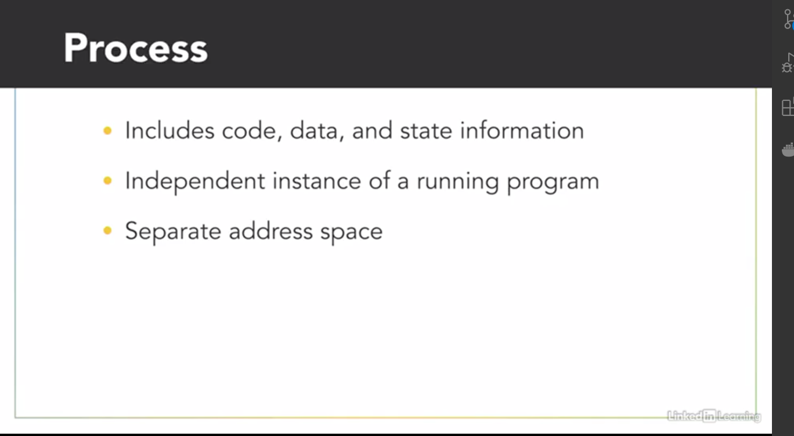
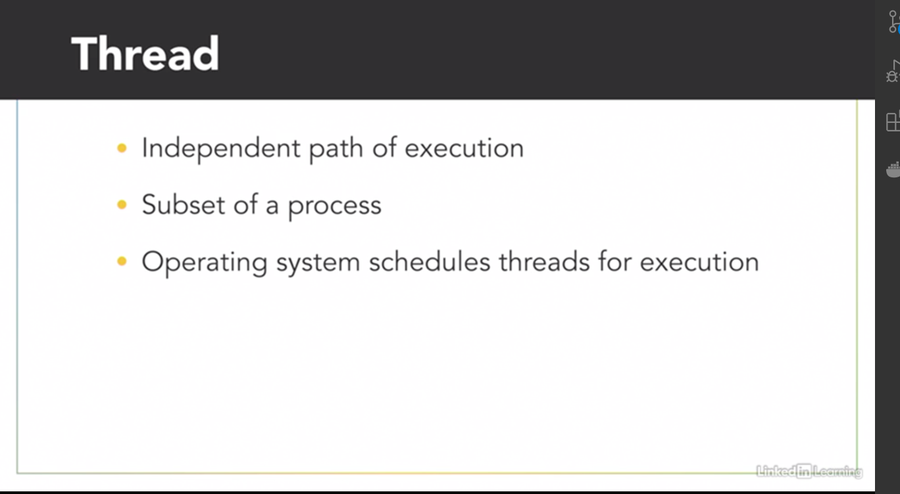
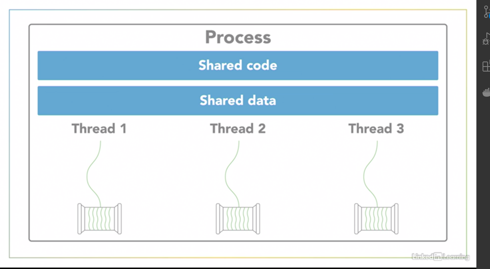
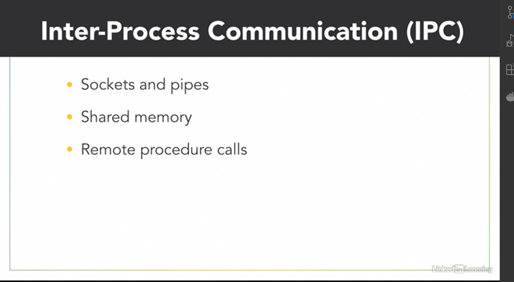

- [Threads and Process](#threads-and-process)
  - [Thread versus Process](#thread-versus-process)
    - [Process](#process)
    - [Thread](#thread)
    - [So which is better ?](#so-which-is-better-)
  - [Thread versus Process: c++ demo](#thread-versus-process-c-demo)
  - [Concurrent versus Parallel execution](#concurrent-versus-parallel-execution)

# Threads and Process

## Thread versus Process

### Process

When a computer runs an application, that *** instance of the program executing is referred to as a process ***. 
A process consists of
- the program's code, 
- its data, and
-  information about its state. 

Each process is independent and has its own separate address space and memory.A computer can have hundreds of active processes at once, and an operating system's job is to manage all of them. -

### Thread

Now within every process, there are one or more smaller sub-elements called threads. These are kind of like tiny processes. 

- Each of those threads is an independent path of execution through the program, a different sequence of instructions. 
- And they can only exist as part of a process. 
- Threads are the basic units that the operating system manages and it allocates time on the processor to actually execute them. 

Threads that belong to the same process share the process's address space, which gives them access to the same resources and memory, including the program's executable code and data.

***Sharing resources between separate processes is not as easy as sharing between threads in the same process***, because every process exists in its own address space. There are ways to communicate and share data between processes, but it requires a bit more work than communicating between threads. You have to use system provided inter-process communication mechanisms like 
- sockets and pipes, 
- allocating special inter-process shared memory space, or 
- using remote procedure calls

### So which is better ?
Now, it's possible to write parallel programs that use multiple processes working together towards a common goal, or using multiple threads within a single process. Using multiple threads or multiple processes? - Well, like most things in programming, it depends. It depends on what you're doing and the environment it's running in, because the implementation of threads and processes differs between operating systems and programming languages. If your application is going to be distributed across multiple computers, you'll most likely need separate processes for that. But as a rule of thumb, if you can structure your program to take advantage of multiple threads, stick with using threads, rather than multiple processes. ***Threads are considered lightweight compared to processes, which are more resource intensive. A thread requires less overhead to create and terminate than a process, and it's usually faster for an operating system to switch between executing threads from the same process, than to switch between different processes***.

## Thread versus Process: c++ demo

## Concurrent versus Parallel execution