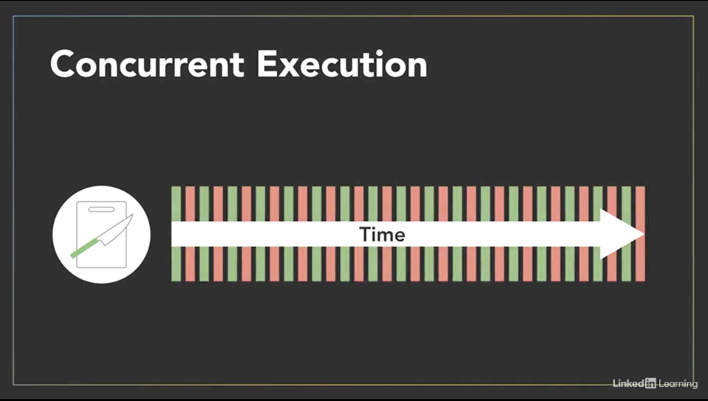

- [Threads and Process](#threads-and-process)
  - [Thread versus Process](#thread-versus-process)
    - [Process](#process)
    - [Thread](#thread)
    - [So which is better ?](#so-which-is-better-)
  - [Thread versus Process: c++ demo](#thread-versus-process-c-demo)
  - [Concurrent versus Parallel execution](#concurrent-versus-parallel-execution)
  - [Execution Scheduling](#execution-scheduling)
  - [Execution Scheduling: C++ demo](#execution-scheduling-c-demo)

# Threads and Process

## Thread versus Process

### Process

When a computer runs an application, that *** instance of the program executing is referred to as a process ***. 
A process consists of
- the program's code, 
- its data, and
-  information about its state. 

Each process is independent and has its own separate address space and memory.A computer can have hundreds of active processes at once, and an operating system's job is to manage all of them. -

### Thread

Now within every process, there are one or more smaller sub-elements called threads. These are kind of like tiny processes. 

- Each of those threads is an independent path of execution through the program, a different sequence of instructions. 
- And they can only exist as part of a process. 
- Threads are the basic units that the operating system manages and it allocates time on the processor to actually execute them. 

Threads that belong to the same process share the process's address space, which gives them access to the same resources and memory, including the program's executable code and data.

***Sharing resources between separate processes is not as easy as sharing between threads in the same process***, because every process exists in its own address space. There are ways to communicate and share data between processes, but it requires a bit more work than communicating between threads. You have to use system provided inter-process communication mechanisms like 
- sockets and pipes, 
- allocating special inter-process shared memory space, or 
- using remote procedure calls

### So which is better ?
Now, it's possible to write parallel programs that use multiple processes working together towards a common goal, or using multiple threads within a single process. Using multiple threads or multiple processes? - Well, like most things in programming, it depends. It depends on what you're doing and the environment it's running in, because the implementation of threads and processes differs between operating systems and programming languages. If your application is going to be distributed across multiple computers, you'll most likely need separate processes for that. But as a rule of thumb, if you can structure your program to take advantage of multiple threads, stick with using threads, rather than multiple processes. ***Threads are considered lightweight compared to processes, which are more resource intensive. A thread requires less overhead to create and terminate than a process, and it's usually faster for an operating system to switch between executing threads from the same process, than to switch between different processes***.

## Thread versus Process: c++ demo

## Concurrent versus Parallel execution

Just because a program is structured to have multiple threads or processes does not mean they'll necessarily execute in parallel. A concept that's closely related to parallel execution but often gets confused with it is concurrency. ***Concurrency refers to the ability of an algorithm or program to be broken into different parts that can be executed out of order or partially out of order without affecting the end result***. 

Concurrency is about how a program is structured and the composition of independently executing processes. Consider this recipe to make a salad, which includes several steps that involve slicing and chopping vegetables. We can decompose those steps into a collection of concurrent tasks because the relative order in which we do them doesn't matter. They're order independent. 

To keep things simple, let's just focus on two of those tasks for now. I'll chop onions. - And I'll slice cucumbers. This knife represents our computer's processor. We only have one knife so this is a single-core processor and only one of us will be able to execute our vegetable-chopping routine at any given time. - We'll have to take turns. You go first. - Thanks. My thread will use a processor to execute and slice some cucumbers. Then after a bit, we'll swap places. - Now my thread gets some time to execute and slice onions. - I want to slice now. - So we'll swap places again and we'll keep on doing this until we're both done. In this scenario, we're running concurrently because our two independent processes overlap in time.

However, since we only have a single processor, only one of us will actually be executing at any instant in time. If we swap places and take turn more frequently, it might create the illusion that we're executing simultaneously on our single processor but this is not true parallel execution. 

***To actually execute in parallel, we need parallel hardware***. In our kitchen, that means another knife and cutting board, a second processor. But in regards to computers, parallel hardware can come in a variety of forms. Most modern processors used in things like desktop computers and cellphones have multiple processing cores. Graphics processing units or GPUs contains hundreds or even thousands of specialized cores working in parallel to make amazing graphics that you see on the screen.

And computer clusters distribute their processing across multiple systems. Since we've structured ourselves as concurrent operations, I can begin slicing cucumbers with this processor. - While I cut onions with the other one. Now we're actually executing in parallel because we're both executing at the same time and as a result, we're able to finish the job faster. 

Concurrency is about the structure of a program being able to deal with multiple things at once whereas parallelism is about simultaneous execution, actually doing multiple things at once. Those things could be related, like chopping vegetables, but they don't have to be. ***Concurrency enables a program to execute in parallel, given the necessary hardware, but a concurrent program is not inherently parallel***. - And programs may not always benefit from parallel execution. For example, the software drivers that handle I/O devices like a mouse, keyboard, and hard drive need to execute concurrently. 

They're managed by the operating system as independent things that get executed as needed. In a multi-core system, the execution of those drivers might get split amongst the available processors. However, since I/O operations occur rather infrequently relative to the speed at which computer operates, we don't really gain anything from parallel execution. Those sparse independent tasks could run just fine on a single processor and we wouldn't feel a difference. 

***Concurrent programming is useful for I/O-dependent tasks like graphical user interfaces***. When the user clicks a button to execute an operation that might take a while, to avoid locking up the user interface until it's completed we can run the operation in a separate concurrent thread. This leaves the thread that's running the UI free to accept new inputs. - That sort of IO-dependent task is a good use case for concurrency.

Parallel processing really becomes useful for computationally-intensive tasks such as calculating the result of multiplying two matrices together. When large math operations can be divided into independent sub-parts, executing those parts in parallel on separate processors can really speed things up.

## Execution Scheduling

Threads don't just execute whenever they want to. A computer might have hundreds of processes with thousands of threads that all want their turn to run on just a handful of processors. So, how do they decide who goes first? - That's the operating system's job. The OS includes a scheduler that controls when different threads and processes get their turn to execute on the CPU. 

The scheduler makes it possible for a multiple programs to run concurrently on a single processor. When a process is created and ready to run it gets loaded into memory and placed in the ready queue. Think of these as cooks in the kitchen that are ready to work. 

The scheduler is like the head chef that tells the other cooks when they get to use the cutting board. 

It cycles through the ready processes so they get a chance to execute on the processor. 

If there are multiple processors, then the OS will schedule processes to run on each of them to make the most use of the additional resources.

A process will run until it finishes and then the scheduler will assign another process to execute on that processor.

Or, a process might get blocked and have to wait for an I/O event in which case, it'll go into a separate I/O waiting queue so another process can run. 

Or, the scheduler might determine that a process has spent its fair share of time on the processor and swap it out for another process from the ready queue. When that occurs, it's called a ***context switch***. 

The operating system has to state the state or context of the process that was running so it can be resumed later. And it has to load the context of the new process that's about to run. If I'm a process that's executing on this processor to chop cucumbers, when a scheduler decides it's time for a context switch, I'll need to pause what I'm doing and store the state of that task. - And as the new process that just got scheduled, I'll load my state information and then begin executing. Now, ***context switches are not instantaneous. It takes time to save and restore the registers and memory state***, so the scheduler needs a strategy for how frequently it switches between processes. There's a wide variety of algorithms that different operating system schedulers implement.

Some of these algorithms are preemptive which means they may pause or preempt a running low-priority task when a higher priority task enters the ready state. In non-preemptive algorithms, once a process enters the running state it'll be allowed to run for its allotted time. Which algorithm a scheduler chooses to implement will depend on its goals. Some schedulers might try to maximize throughput or the amount of work they complete in a given time. Whereas others might aim to minimize latency to improve the system's responsiveness. Different operating systems have different purposes and a desktop OS like Windows will have a different set of goals and use a different type of scheduler than a real-time OS for embedded systems.

Now, while it's important to understand the concept of scheduling and that it's taking place, you usually don't need to worry about the nitty gritty details of how the scheduler works because it's often handled under the hood by the operating system. In fact, you might not have any control over when the parts of your program actually execute. - And that's an important thing to keep in mind. Avoid writing programs expecting that multiple threads or processes will execute in a certain order or for an equal amount of time, because the operating system may choose to schedule them differently from run to run.

## Execution Scheduling: C++ demo

