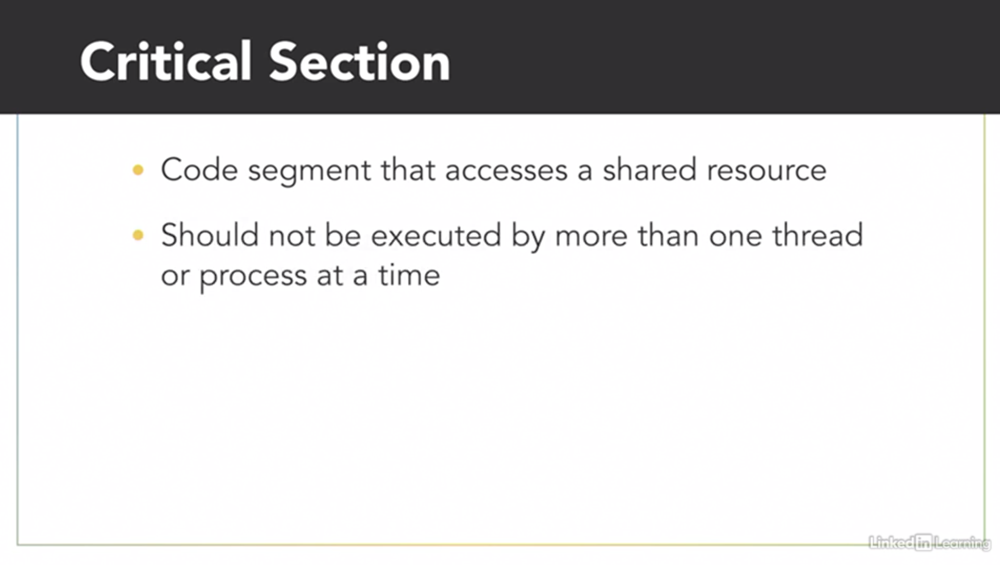
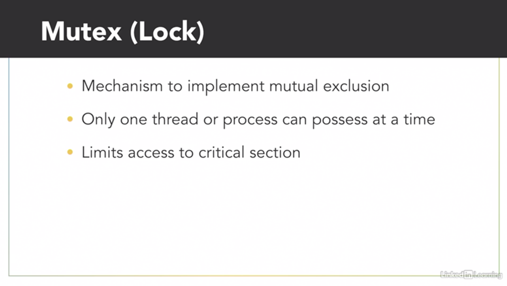
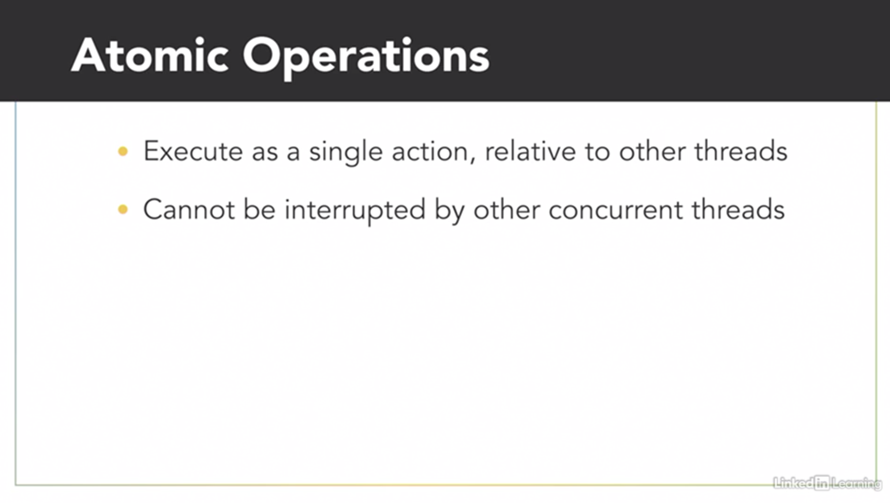
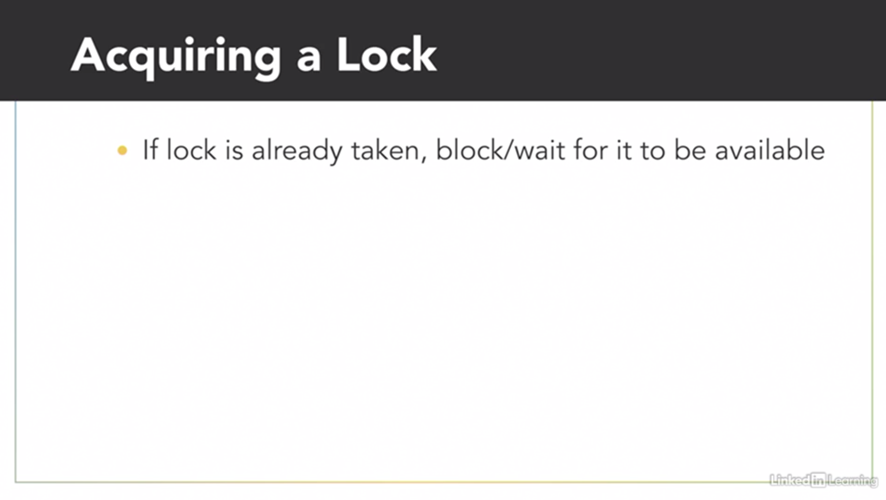
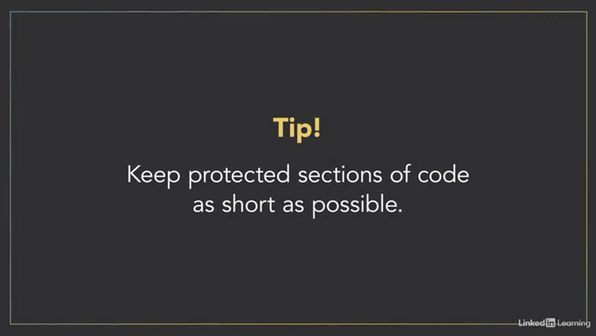

- [Mutual Exclusion](#mutual-exclusion)
  - [Data race](#data-race)
  - [Data race: C++ demo](#data-race-c-demo)
  - [Mutual Exclusion](#mutual-exclusion-1)
  - [Mutual Exclusion: C++ demo](#mutual-exclusion-c-demo)
  - [Atomic Objects: C++ demo](#atomic-objects-c-demo)

# Mutual Exclusion

## Data race

One of the main challenges of writing concurrent programs is identifying the ***possible dependencies*** between threads to make sure they don't interfere with each other and cause problems. Data races are a common problem that can occur when two or more threads are concurrently accessing the same location in memory, and at least one of those threads is writing to that location to modify its value.
 
Fortunately, you can protect your ***program against data races by using synchronization techniques***, which we'll show you later, but to eventually use those techniques, you'll first need to know how to recognize the data race. 

Olivia and I are two concurrent threads working together to figure out what we need to buy from the grocery store. I'll take inventory of the pantry, and when I see that we're running low on something, I'll add more of that item to our shared shopping list. And while Barron does that, I'll look through my recipe book, and I'll add ingredients to our shopping list for the meals I wanted us to cook this week. Even though we're two separate threads doing different tasks, we run the risk of a data race because ***we're both accessing and modifying the same shared resource, our shopping list***. Now, to the pantry. Oh, this garlic mashed potato recipe looks delicious. I'll need five potatoes for it. I see that our shopping list already has three potatoes on it, three plus five is eight. So I'll erase three, and write down eight. As you can see, ***even a simple operation like adding two numbers is actually a multiple-step process***.
 
First, I had to read the existing value of that item from the shopping list. Then I modified the value by adding what I needed to it. And finally, I wrote the result back to the shopping list. It looks like we're running low on garlic in the pantry. I think we should restock it with two more cloves. I see that there's currently one clove of garlic on the list. One plus two is uh, uh. - My garlic mashed potato recipe calls for five cloves of garlic. I see there's currently one clove of garlic on the list. One plus five is six. So I'll update the list to have six cloves on it. - Three, one plus two is three. We need three cloves of garlic. - And now we have a problem. The shopping list started with one clove of garlic. Barron wanted to add two more, and I needed to add five more. One plus two plus five means we should have ended up with eight cloves of garlic on this list, but somehow, we only have three. I need more garlic for my mashed potatoes. - We just had a data race. 

As concurrent threads, it's up to the operating system to schedule when we each get to execute. Right after I read the value of one from that shared shopping list, my thread got paused. - Then my thread became active and changed the number of garlic from one to six. - And finally, my thread became active again, and at that point, I was operating with old data in my local memory because I thought the existing value of garlic on the shopping list was still one. So I finished my operation by changing it to three. In this example, it was the unfortunate timing of when our threads were scheduled that caused the problem. But the unpredictability of when threads get scheduled means sometimes the data race will occur and cause problems, but other times, everything might work just fine. And that inconsistency makes data races a real challenge to recognize and debug.

## Data race: C++ demo

 

## Mutual Exclusion

Anytime multiple threads are concurrently reading and writing a shared resource, it creates the potential for incorrect behavior, like a data race. But we can defend against that by identifying and protecting critical sections of code. ***A critical section, or critical region, is part of a program that accesses a shared resource, such as a data structured memory, or an external device, and it may not operate correctly if multiple threads concurrently access it***.
 
The critical section needs to be protected so that it only allows one thread or process to execute in it at a time. - Baron and I experienced a data race as we added garlic to our shared shopping list, because incrementing a value is actually a three-step process. 

- Read the current value, 
- modify it, and 
- then write back the result. 

Those three steps are a critical section, and ***they need to execute as an uninterrupted action***, so we don't accidentally overwrite each other. I have an idea. - Give me your pencil. (pencil snapping) - Hey, I was using that! - Now there's only one pencil for us to share, and the rule is that only the person holding the pencil can access the shopping list, either to read or write it. That way, one of us won't accidentally read a wrong value because the other one is only halfway done updating it. In this arrangement, the pencil is serving as a mechanism called a ***mutex, short for mutual exclusion***, which you'll also hear referred to as a lock. 

Only one thread or process can have possession of a lock at a time so it can be used to prevent multiple threads from simultaneously accessing a shared resource, forcing them to take turns. If either of us wants to access the shopping list, we first need to pick up the pencil to acquire the lock on it, we do whatever we need to with the shared notepad, and then when we're done, release the lock by putting down the pencil. **The operation to acquire the lock is an atomic operation, which means it's always executed as a single indivisible action**. To the rest of the system, an atomic operation appears to happen instantaneously, even if under the hood, it really takes multiple steps. The key here is that the atomic operation is uninterruptible. - So if I grab the pencil. - Acquiring the mutex is an atomic action that no other thread can interfere with halfway through. Either you have the mutex, or you don't. And now that you do have a lock on our pencil, you can safely execute in the critical section. 

- I see we already have 10 carrots on the list. I'll add five more to that. - Oh (snapping), and we're going to need some more onions too. - Well, I currently possess a mutex, so you'll have to wait until I'm done. Threads that try to acquire a lock that's currently possessed by another thread can pause and wait 'til it's available. 

- There, I'm done with the notepad for now. So I'll release the lock. - And I'll acquire the lock so I can add onions to the list. - Don't forget to release the mutex when you're done. - Okay. - Since threads can get blocked and stuck waiting for a thread in the critical section to finish executing, ***it's important to keep the section of code protected with the mutex as short as possible***.

- If I take the pencil, execute a critical section by adding more lettuce, and then hold onto the pencil while I contemplate what else to buy. - I'm stuck waiting for Olivia to return the pencil so I can use it. I'm getting kind of annoyed. - Only thinking about what I want to buy doesn't actually require the shared notepad, so the operation doesn't require mutual exclusion. I should've returned the pencil as soon as I was done updating the list. That way, Baron could use it to execute the critical section while I'm busy doing other things.

## Mutual Exclusion: C++ demo

## Atomic Objects: C++ demo