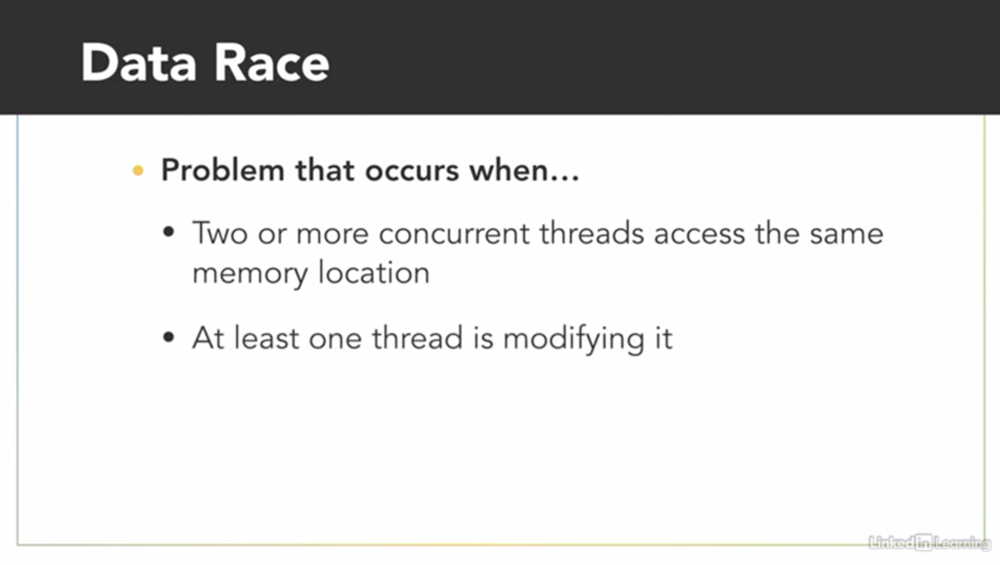
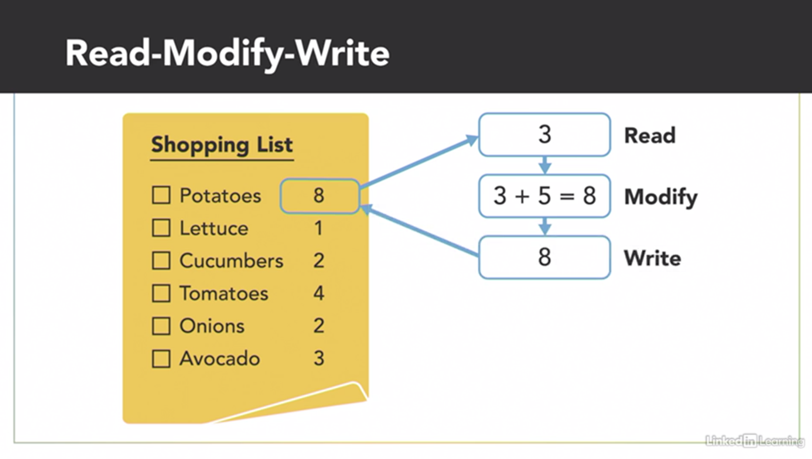
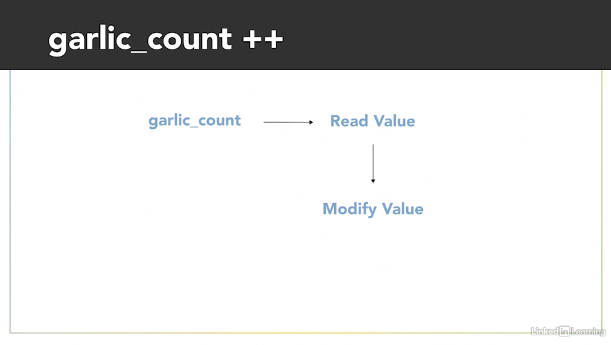
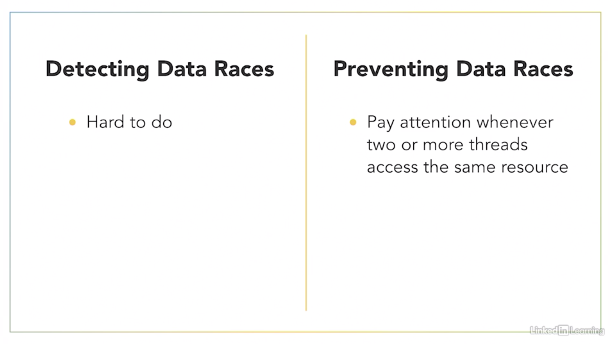

- [Mutual Exclusion](#mutual-exclusion)
  - [Data race](#data-race)
  - [Data race: C++ demo](#data-race-c-demo)
  - [Mutual Exclusion](#mutual-exclusion-1)
  - [Mutual Exclusion: C++ demo](#mutual-exclusion-c-demo)
  - [Atomic Objects: C++ demo](#atomic-objects-c-demo)

# Mutual Exclusion

## Data race

One of the main challenges of writing concurrent programs is identifying the ***possible dependencies*** between threads to make sure they don't interfere with each other and cause problems. Data races are a common problem that can occur when two or more threads are concurrently accessing the same location in memory, and at least one of those threads is writing to that location to modify its value.
 
Fortunately, you can protect your ***program against data races by using synchronization techniques***, which we'll show you later, but to eventually use those techniques, you'll first need to know how to recognize the data race. 

Olivia and I are two concurrent threads working together to figure out what we need to buy from the grocery store. I'll take inventory of the pantry, and when I see that we're running low on something, I'll add more of that item to our shared shopping list. And while Barron does that, I'll look through my recipe book, and I'll add ingredients to our shopping list for the meals I wanted us to cook this week. Even though we're two separate threads doing different tasks, we run the risk of a data race because ***we're both accessing and modifying the same shared resource, our shopping list***. Now, to the pantry. Oh, this garlic mashed potato recipe looks delicious. I'll need five potatoes for it. I see that our shopping list already has three potatoes on it, three plus five is eight. So I'll erase three, and write down eight. As you can see, ***even a simple operation like adding two numbers is actually a multiple-step process***.
 
First, I had to read the existing value of that item from the shopping list. Then I modified the value by adding what I needed to it. And finally, I wrote the result back to the shopping list. It looks like we're running low on garlic in the pantry. I think we should restock it with two more cloves. I see that there's currently one clove of garlic on the list. One plus two is uh, uh. - My garlic mashed potato recipe calls for five cloves of garlic. I see there's currently one clove of garlic on the list. One plus five is six. So I'll update the list to have six cloves on it. - Three, one plus two is three. We need three cloves of garlic. - And now we have a problem. The shopping list started with one clove of garlic. Barron wanted to add two more, and I needed to add five more. One plus two plus five means we should have ended up with eight cloves of garlic on this list, but somehow, we only have three. I need more garlic for my mashed potatoes. - We just had a data race. 

As concurrent threads, it's up to the operating system to schedule when we each get to execute. Right after I read the value of one from that shared shopping list, my thread got paused. - Then my thread became active and changed the number of garlic from one to six. - And finally, my thread became active again, and at that point, I was operating with old data in my local memory because I thought the existing value of garlic on the shopping list was still one. So I finished my operation by changing it to three. In this example, it was the unfortunate timing of when our threads were scheduled that caused the problem. But the unpredictability of when threads get scheduled means sometimes the data race will occur and cause problems, but other times, everything might work just fine. And that inconsistency makes data races a real challenge to recognize and debug.

## Data race: C++ demo

 

## Mutual Exclusion

## Mutual Exclusion: C++ demo

## Atomic Objects: C++ demo